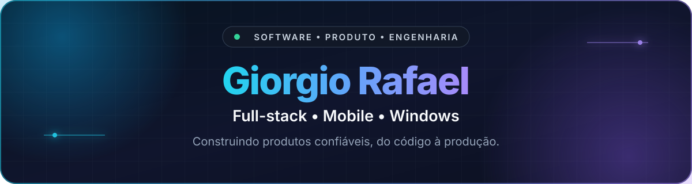

  

  

    
    
    
  

## Sobre mim

Sou **Giorgio Rafael**, desenvolvedor de software e graduando em Ciência da Computação. Construo produtos completos — da interface e experiência do usuário às APIs, banco de dados, integrações, testes e entrega em produção.

Meu trabalho recente passa por **TypeScript/React**, aplicações nativas para Windows com **C#/.NET**, APIs em **Java/Spring Boot**, automações em **Python** e desenvolvimento mobile com **React Native/Expo**.

- **Full stack:** SaaS, painéis administrativos, autenticação, pagamentos, webhooks e integrações com Discord.
- **Desktop & Mobile:** WinUI 3, Bluetooth LE, Android/iOS, notificações e otimização de interfaces.
- **Engenharia:** arquitetura, testes automatizados, segurança, performance, CI/CD e documentação técnica.

## Stack aplicada nos projetos

  
<strong>Frontend & Mobile</strong>

  
  
  
  
  
  
  
  

  
<strong>Backend, Desktop & Dados</strong>

  
  
  
  
  
  
  
  
  

  
<strong>Qualidade & Entrega</strong>

  
  
  
  
  
  

## Projetos em destaque

### 🏃 [Rivlo](https://www.rivlo.com.br)

Plataforma fitness full-stack e multiplataforma para planejar musculação e corrida, executar treinos e acompanhar histórico, consistência e evolução. Minhas contribuições passam pelo app mobile, backend, integrações nativas de saúde, notificações, recursos sociais, experiências assistidas por IA, analytics e performance.

`React Native` `Expo` `TypeScript` `Node.js` `PostgreSQL` `Railway`

[Conhecer o Rivlo →](https://www.rivlo.com.br) · [App Store](https://apps.apple.com/br/app/rivlo/id6766415215) · [Google Play](https://play.google.com/store/apps/details?id=br.com.rivlo.mobile)

### 🎧 [OpenQCY Desktop](https://github.com/GiorgioRafael/OpenQCY-Desktop)

Controlador open source e nativo para fones QCY no Windows 11. O projeto combina uma interface WinUI moderna, perfis locais, descoberta Bluetooth somente leitura e uma fronteira segura para pesquisa do protocolo do dispositivo.

`C# 14` `.NET 10` `WinUI 3` `Bluetooth GATT` `MVVM` `GitHub Actions`

### 🛍️ [GWStore](https://github.com/GiorgioRafael/GodAwpStore)

Plataforma de comércio integrada ao Discord, com painel administrativo, catálogo e estoque transacional, autenticação, checkout Pix, tickets privados e roleta em tempo real. O monorepo inclui aplicação web, worker e regras de domínio compartilhadas.

`Next.js` `TypeScript` `Supabase` `PostgreSQL` `Discord` `Vitest`

[Abrir demonstração →](https://gwstore.vercel.app)

### ⌨️ [Compilador Python Online](https://github.com/GiorgioRafael/CompiladorPython)

Interpretador didático executado no navegador, com análise léxica, parser, AST, execução controlada e mensagens de erro por fase. Inclui cobertura automatizada para estruturas, operadores, tipos e limites de execução.

`React` `JavaScript` `CodeMirror` `Vite` `Vitest`

## Colaborações recentes

Além do trabalho em destaque no Rivlo, também contribuo em outros produtos digitais, trabalhando em:

- fluxos assistidos por IA, contratos compartilhados e APIs Node/Fastify;
- produtos React mobile-first, conteúdo estruturado, SEO e persistência em PostgreSQL.
- revisão de interfaces, acessibilidade, performance e evolução de bases mantidas em equipe.

Essas contribuições complementam meus projetos públicos e mostram experiência em evoluir bases de código de outras equipes, não apenas projetos iniciados por mim.

## Como eu trabalho

- Transformo requisitos de negócio em fluxos claros, responsivos e testáveis.
- Cuido do ciclo completo: arquitetura, implementação, testes, CI e deploy.
- Trato pagamentos, autenticação e integrações com idempotência e segurança.
- Registro decisões técnicas para que o projeto continue sustentável em equipe.

## Atividade no GitHub

  <picture>
    <source media="(prefers-color-scheme: dark)" srcset="https://raw.githubusercontent.com/GiorgioRafael/GiorgioRafael/output/github-snake-dark.svg" />
    <source media="(prefers-color-scheme: light)" srcset="https://raw.githubusercontent.com/GiorgioRafael/GiorgioRafael/output/github-snake.svg" />
    
  </picture>

---

  <strong>Vamos construir algo útil, confiável e pronto para evoluir.</strong>
    
  <a href="https://www.linkedin.com/in/grgrafa/">LinkedIn</a>
  &nbsp;•&nbsp;
  <a href="https://leetcode.com/u/grgcodes/">LeetCode</a>
  &nbsp;•&nbsp;
  <a href="https://stackoverflow.com/users/27181004/grgrafa">Stack Overflow</a>

